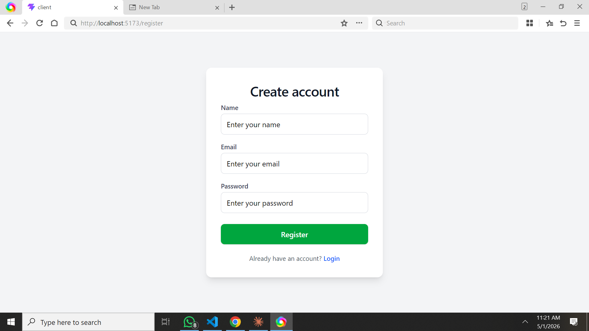
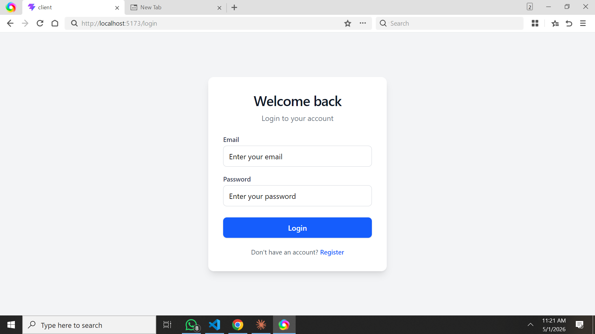
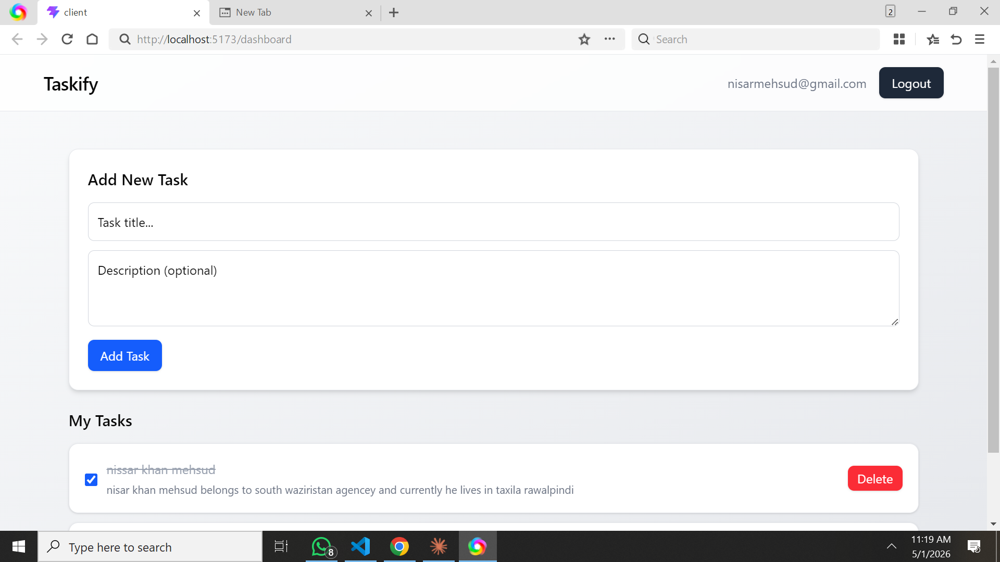
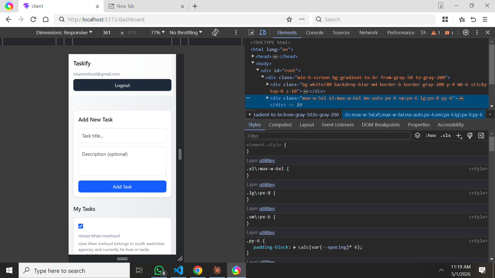

# 🚀 Taskify – MERN Stack Task Management App

Taskify is a full-stack task management application built using the MERN stack (MongoDB, Express, React, Node.js). It allows users to securely manage their daily tasks with authentication and full CRUD functionality.

---

## 📌 Features

* 🔐 User Authentication (Register / Login with JWT)
* 🧾 Create, Read, Update, Delete (CRUD) Tasks
* ✅ Mark tasks as completed or pending
* 👤 User-specific tasks (private data)
* ⚡ Real-time UI updates
* 📱 Responsive design (Tailwind CSS)
* 🔒 Protected routes

---

## 🧠 Tech Stack

### Frontend:

* React.js
* React Router DOM
* Context API (State Management)
* Axios
* Tailwind CSS

### Backend:

* Node.js
* Express.js
* MongoDB (Mongoose)
* JWT Authentication
* bcrypt.js (Password Hashing)

---

## 📁 Project Structure

```
Taskify/
├── Client/        # React frontend
├── Server/        # Node/Express backend
└── README.md
```

---

## ⚙️ Installation & Setup

### 1️⃣ Clone the repository

```
git clone https://github.com/nissar-coder/taskify-mern.git
cd taskify-mern
```

---

### 2️⃣ Setup Backend

```
cd Server
npm install
```

Create a `.env` file inside **Server** folder:

```
MONGO_URI=your_mongodb_connection_string
JWT_SECRET=your_secret_key
```

Run backend:

```
npm run dev
```

---

### 3️⃣ Setup Frontend

```
cd Client
npm install
npm run dev
```

---

## 🌐 API Endpoints

### Auth Routes:

* `POST /api/auth/register`
* `POST /api/auth/login`

### Task Routes:

* `GET /api/tasks`
* `POST /api/tasks`
* `PUT /api/tasks/:id`
* `DELETE /api/tasks/:id`

---

## 🔒 Authentication Flow

* User logs in → receives JWT token
* Token stored in localStorage
* Token sent in headers for protected routes
* Backend verifies token using middleware

---

## 🚀 Future Improvements

* ✏️ Edit task title & description
* 🔍 Search and filter tasks
* 📊 Dashboard analytics
* 🌐 Deployment (Vercel + Render)
* 🧑‍💼 Admin panel

---

## 📸 Screenshots





---

## 🌍 Live Demo

Frontend: (Coming Soon)
Backend: (Coming Soon)

---

## 👨‍💻 Author

**Nissar Mehsud**

---

## ⭐ Contributing

Contributions are welcome! Feel free to fork this repo and submit a pull request.

---

## 📄 License

This project is licensed under the MIT License.
